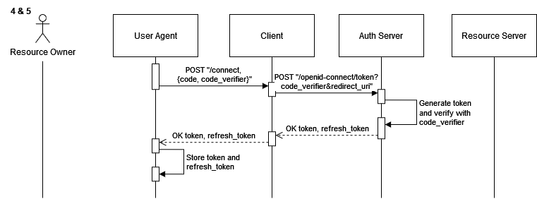

# Oauth2.1 OIDC PKCE demo

This repository demonstrates the [OAuth 2.1 Authorization Framework](https://datatracker.ietf.org/doc/html/draft-ietf-oauth-v2-1-11) authorization Code Flow with [OpenId Connect](openid.net) (OIDC) to obtain limited access to a protected resource. [Proof Key for Code Exchange](https://datatracker.ietf.org/doc/html/rfc7636) (PKCE) and the EdDSA digital signature algorithm provide an extra layer of security against authorization code interception attacks. Included are a user agent, authorization server, resource server and client to securely authenticate users, manage JWT access tokens and retrieve data from the protected resource server.

## Features
- Login/Logout with Keycloak.
- Extracting user info from JWT token.
- Refreshing access token with refresh token.
- Retrieving data from protected resource server.
- Transforming retrieved data in client before serving to user agent.

## Built with
- **Client & resource server:** [Express.js](https://expressjs.com)
- **User agent:** [Vue.js](https://vuejs.org) with [Vite](https://vite.dev) and [pinia](https://pinia.vuejs.org)
- **Auth**: [Keycloak](https://keycloak.org)

## Getting started
This project is built on [Node.Js](https://nodejs.org) with javascript. This sections explains the steps to set this project up locally.

### Prerequisites
<!-- - [npm](npmjs.com) -->
- [Docker Desktop](https://docker.com/products/docker-desktop/)

### Installation
1. clone the repo.
```sh
   git clone https://github.com/dirkzon/oauth2.1-oidc-pkce-demo.git
```

2. CD into the project directory.
```sh
   cd oauth2.1-oidc-pkce-demo
```

3. Start up the services.
```sh
   docker-compose up --build
```
*All services should now be running in Docker Desktop.*


4. Navigate to [http://localhost:5173/](http://localhost:5173/).

5. Login with one of the predefined users:
   - **John Doe**
      - username: `johndoe`
      - password: `password` 
   - **Jane Doe**
      - username: `janedoe`
      - password: `password` 

6. Stop the services.
```
   Ctrl + C
```
```sh
   docker-compose down
```

## How it works
This repository demonstrates the [authorization code flow/grant type](https://datatracker.ietf.org/doc/html/draft-ietf-oauth-v2-1-11#name-authorization-code-grant) as described by the OAuth 2.1 Authorization Framework. 
This grant type is used to obtain both access tokens and refresh tokens. Clients utilizing the Authorization Code Grant are susceptible to the authorization code interception attack. 
[PKCE](https://datatracker.ietf.org/doc/html/rfc7636) is a  technique to mitigate these threats.

The OAuth 2.1 Authorization Framework defines four roles:
1. **resource owner (RO):** An entity capable of granting access to a protected resource. When the resource owner is a person, it is referred to as an end user. This user will the user will interact with the client through a **user agent**.
2. **resource server (RS):** The server hosting the protected resources, capable of accepting and responding to protected resource requests using access tokens.
3. **client:** An application making protected resource requests on behalf of the resource owner and with its authorization.
4. **authorization server (AS):** The server issuing access tokens to the client after successfully authenticating the resource owner and obtaining authorization.

Below a number of sequence diagrams illustrate how these entities communicate with one another to preform the authorization code flow to obtain an access token and user info.
The flow includes the following steps as defined by [OAuth2.1](https://datatracker.ietf.org/doc/html/draft-ietf-oauth-v2-1-11#section-4.1-5):

### 1. Authorization Request Initialization
The client initiates the flow by directing the resource owner's user agent to the authorization endpoint. The client includes its client identifier, code challenge (derived from a generated code verifier), optional requested scope, optional local state, and a redirect URI to which the authorization server will send the user agent back once access is granted (or denied).


 ### 2. Resource Owner Authentication
The authorization server authenticates the resource owner (via the user agent) and establishes whether the resource owner grants or denies the client's access request.

### 3. Authorization Code Grant and Redirect
Assuming the resource owner grants access, the authorization server redirects the user agent back to the client using the redirect URI provided earlier (in the request or during client registration). The redirect URI includes an authorization code and any local state provided by the client earlier.


 ### 4. Token Request with Authorization Code and Code Verifier
The client requests an access token from the authorization server's token endpoint by including the authorization code received in the previous step, and including its code verifier. When making the request, the client authenticates with the authorization server if it can. The client includes the redirect URI used to obtain the authorization code for verification.

 ### 5. Token Grant and Validation
The authorization server authenticates the client when possible, validates the authorization code, validates the code verifier, and ensures that the redirect URI received matches the URI used to redirect the client in step (3). If valid, the authorization server responds back with an access token and, optionally, a refresh token.



### 6. Data Retrieval from Protected Resource (Optional)
*This step is not part of the authorization code flow. But is shown for completeness.*

At startup, the resource server retrieves public keys from the authorization server as JWKS, validating access tokens and updating the keys every hour. After authentication, the user navigates to the "profile" page, then the client requests travel data. The client retrieves destination data from the resource server, which validates the access token against the JWKS. If valid, the resource server returns the destinations to the client, which calculates the total distance and sends it back to the user agent.

